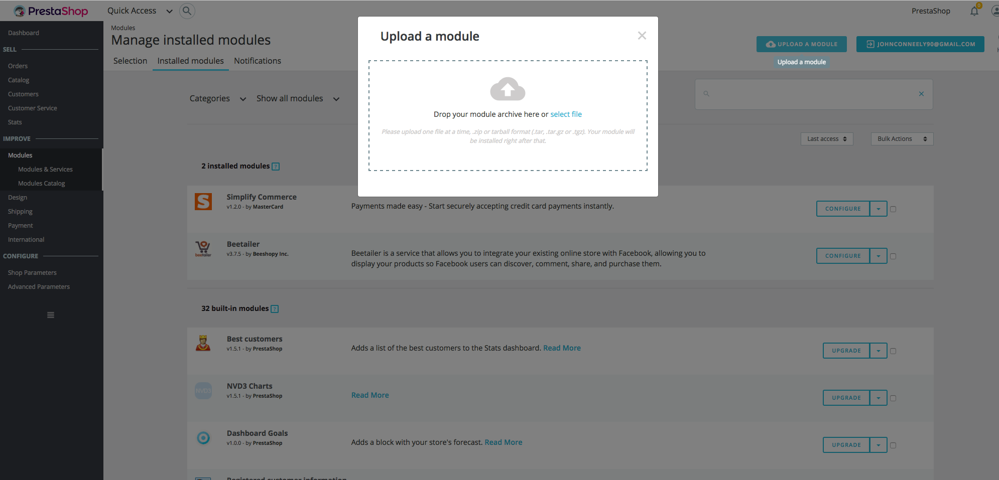

# Simplify Commerce Payment module for PrestaShop

This plugin uses Simplify Commerce to connect your merchant account to PrestaShop and to set up a payment option on your PrestaShop checkout page.

## Installation

The Simplify Commerce module is not bundled in the PrestaShop download.

The addon for Simplify Commerce can be downloaded here: https://github.com/simplifycom/simplify-prestashop-module/releases
Please use the lastest release that corresponds to the version of prestashop you are using. Download the SimplifyCommerce.zip for the particular version of prestashop.

You will then upload the zip file, setup the API keys and you are good to go! 

You can manage your merchant account (view orders, perform refunds, create invoices etc.) using your merchant portal.

## License
This software is Open Source, released under the BSD 3-Clause license. See licence.txt for more info.
