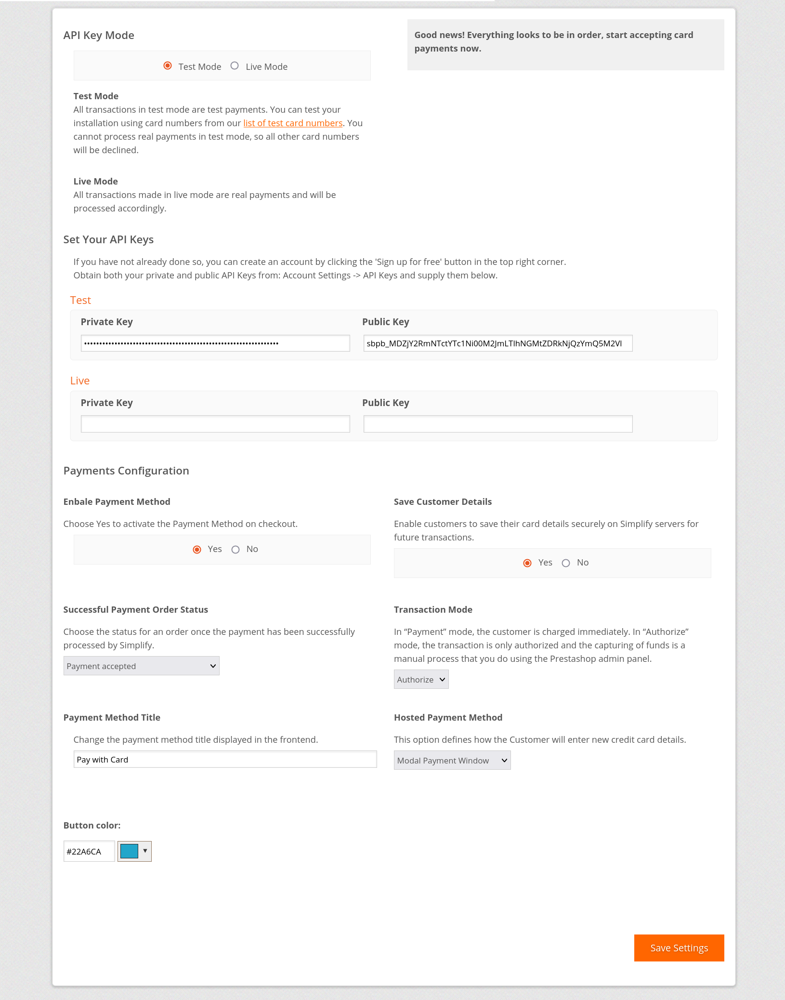
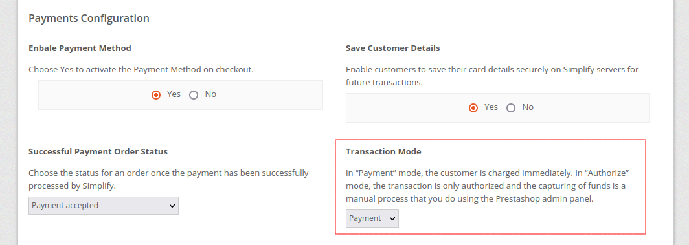
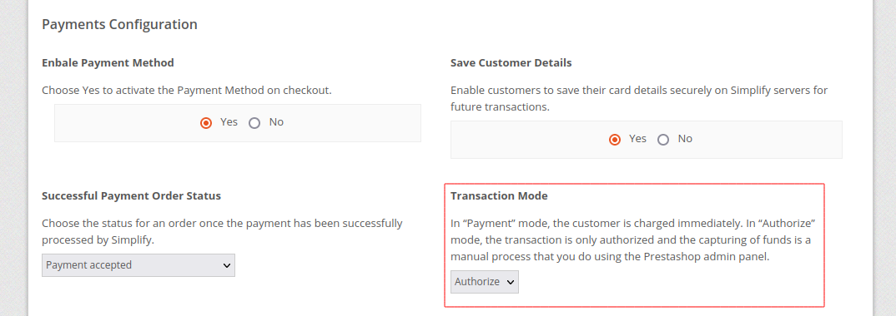
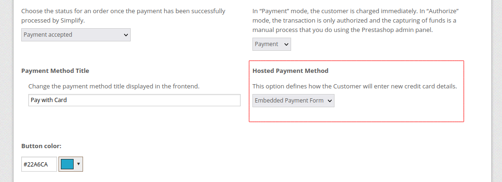
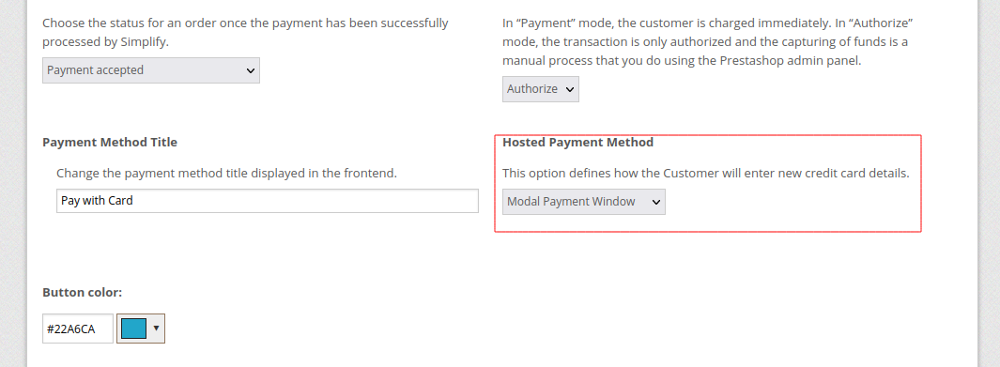
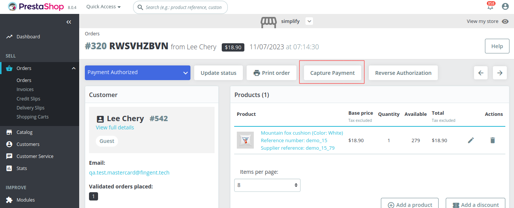
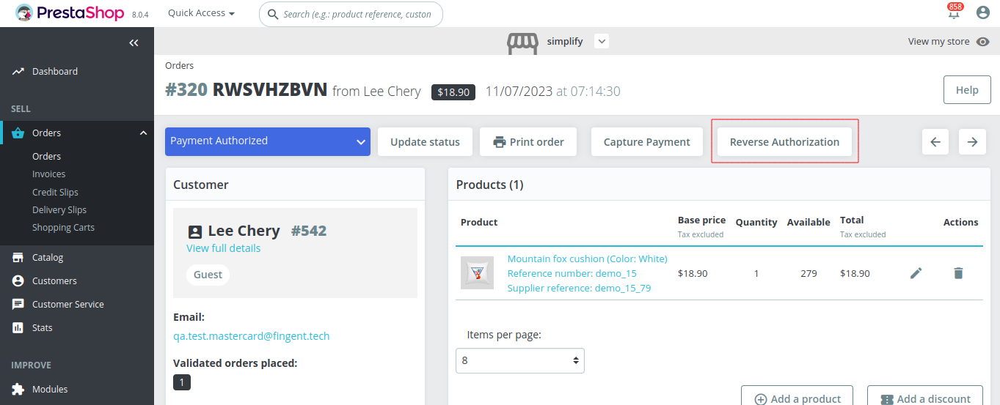
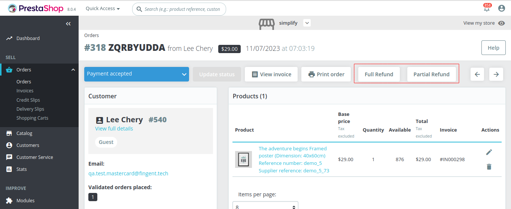

# Simplify Commerce Payment module for PrestaShop

This plugin adds Simplify Commerce as a payment option on your PrestaShop checkout page.

The Simplify Commerce module is not bundled in the PrestaShop download.

## System Requirements

The latest release of the plugin has the following system requirements:

- PHP version 8.0 or higher is mandatory.
- PrestaShop version 8.0.4 or later is required. However, we strongly recommend using the latest available version of PrestaShop for optimal performance.

## Documentation

Click here to access the documentation: https://mpgs.fingent.wiki/simplify-commerce/simplify-commerce-payment-module-for-prestashop/installation/

## Support

For customer support:https://mpgsfgs.atlassian.net/servicedesk/customer/portals

## Compatibility
Versions v1.0.0 to v1.0.12
- Compatible with PrestaShop versions up to 1.4 - 1.6.

Versions v1.1.0
- Compatible with PrestaShop 1.7+.

Version v2.0.0
- Major release to remove the standard payment form integration. Only hosted payments can now be made from the plugin.

Version v2.0.1
- Fixing some plugin links.

Version v2.1.0
- Authorization + Capture modes in addition to Payment.
- Capture and Reverse (void) operation in admin.
- Updated Simplify SDK.
- Refactored dist creation.
- Cleanup.
- Making changes to make plugin function with non ISO-8859-1 Characters (Greek, Arabic...) by processing Hosted payment fields through translit.

Version v2.2.0
- Branding Update.
- Add Embedded Payment Option.

Version v2.2.1
- The installation process is always indicated failure the first time while the module is installed.
- Tokenization option is visible for Guest on Storefront.
- Payments fail if the 3DSecure authorization is required.

Version v2.3.0
- Text update and information section removal on the plugin Configuration page.

Version v2.4.0
- Enhanced Compatibility: Compatible with PHP 8.1 & PrestaShop 8.0.x (tested with v8.0.4).
- Updated Simplify SDK Version to 1.7.0.
- Full Refund and Partial Refund Operation in Admin Panel.

## Installation
1. Make a backup of your site before applying new mods etc.
2. Download .zip file of the latest release of the extension from https://github.com/simplifycom/simplify-prestashop-module/releases/latest
3. Go to Admin → Modules → Module Manager → Upload a Module and upload the downloaded .zip file.
4. After uploading the PrestaShop Module, click Configure button . 

## Configuration
Please proceed with the following actions to configure the payment method:

1. Log in to your PrestaShop administration application.
2. Go to Modules > Module Manager
3. Scroll down until you find the 'Mastercard Payment Gateway Services - Simplify' extension, and click on the Configure button
4. Enter your public and private API keys into the appropriate fields for the Live and Test mode. For information on your API keys go to https://www.simplify.com/commerce/docs/misc/index. NOTE:When working with Hosted Payments, you'll need to establish and activate an API key pair designed for Hosted Payments.
5. Select the Enable Payment Method to 'Yes'.
6. Enter a Payment Method Title. This will be the name shown to your users on the checkout form.
7. Choose between Payment and Authorize in Transaction Mode.
8. Choose between Embedded Payment Form and Modal Payment Window in Hosted Checkout Method.  
9. Map the Successful and Declined status to suit your workflow. This does not affect the Simplify Commerce configuration.
10. If you use multiple Payment Providers you can use Sort Order to configure how they're shown on the checkout form.
11. Don't forget to Enable the extension to activate it.

## Transaction Mode

### Payment

In “Payment” mode, the customer is charged immediately when the payment completed.

### Authorize

In “Authorize” mode, the transaction is only authorized and the capturing of funds is a manual process that you do using the PrestaShop admin panel.

## Hosted Payment Method

### Embedded Payment Form

A secure payment form will be presented right on the checkout page. The customer can input their card details into that form and submit it to place an order.

### Modal Payment Window

Clicking the 'Confirm Order' button triggers the secure payment form, where customers can safely enter their card information.

## Back-office Operations

### Capture Transaction

To capture the order, go to the order details page and click the "Capture Payment" button provided.

### Reverse Authorization

Reverse Authorization is used to cancel order if merchant finds any fraud/suspect in that order.

### Refund / Partial Refund Transactions

When the order has been captured successfully, the "Full Refund" and "Partial Refund" buttons will be visible to the admin on the order details page.

