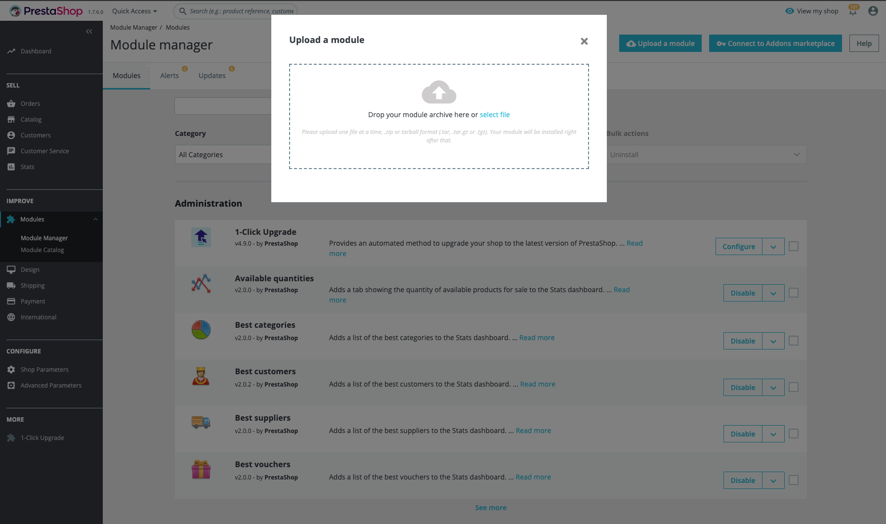

# Simplify Commerce Payment module for PrestaShop

This plugin adds Simplify Commerce as a payment option on your PrestaShop checkout page.

This module has been tested with following versions of PrestaShop:

- 1.7.5.0
- 1.7.5.2
- 1.7.6.0

## Installation

The Simplify Commerce module is not bundled in the PrestaShop download.

The addon for Simplify Commerce can be downloaded here: https://github.com/PrestaShop/simplifycommerce/raw/master/dist/simplifycommerce.zip

You will then upload the zip file, setup the API keys and you are good to go! 

You can manage your Simplify account (view deposits, perform refunds, create invoices etc.) using the Simplify dashboard at https://www.simplify.com/commerce/.

## License
This software is Open Source, released under the BSD 3-Clause license. See licence.txt for more info.
